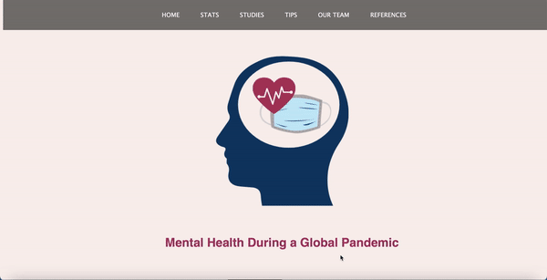

# Welcome to Mental Health in Quarantine

Four hackathon participants created an educational hack on mental health in quarantine to highlight the detrimental effects that the pandemic has made on students and people in the workplace, and to give some brief tips on handling productivity and work life balance using Glitch.

## GIF

## Website

Initially done as our project (<https://mental-health-covid.glitch.me/>) during the SharkHack MiniHack on Oct 9th, 2020.
